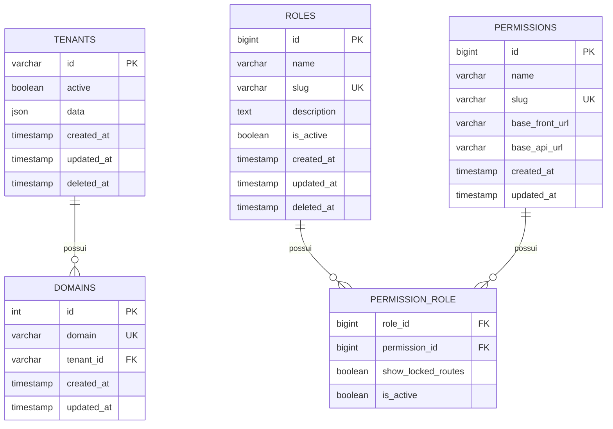
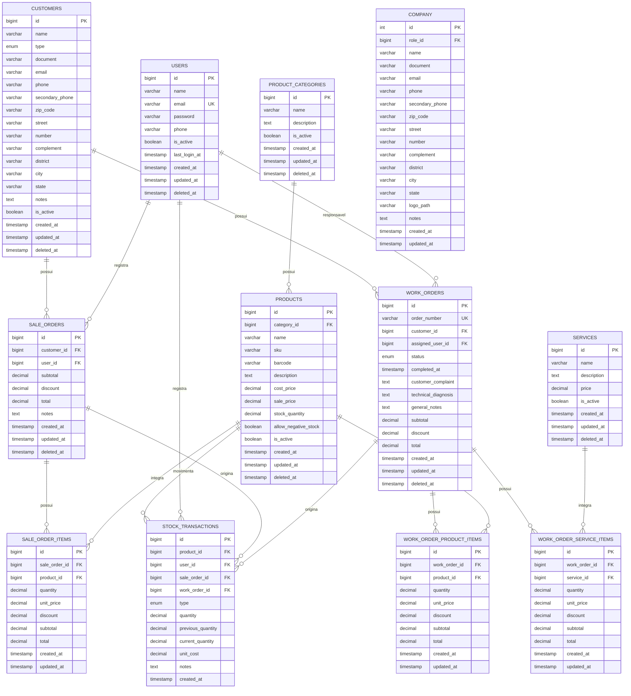

# ERD - Modelagem Inicial

Este documento separa a modelagem em dois contextos:

- **Banco base**: armazena informações globais da plataforma.
- **Banco do tenant**: armazena os dados operacionais de cada tenant.

O ERD descreve a estrutura planejada e não cria tabelas, migrations ou funcionalidades.

## Banco base

## Banco do tenant

