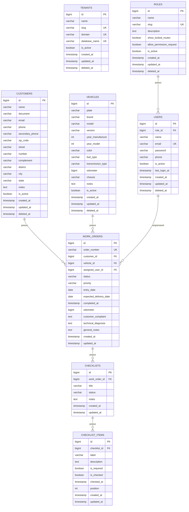

# 📊 ERD - Modelagem Inicial

```mermaid
erDiagram
    TENANTS {
        bigint id PK
        varchar name
        varchar slug UK
        varchar domain UK
        varchar database_name UK
        boolean is_active
        timestamp created_at
        timestamp updated_at
        timestamp deleted_at
    }

    ROLES {
        bigint id PK
        varchar name
        varchar slug UK
        text description
        boolean show_locked_routes
        boolean allow_permission_request
        boolean is_active
        timestamp created_at
        timestamp updated_at
        timestamp deleted_at
    }

    USERS {
        bigint id PK
        bigint role_id FK
        varchar name
        varchar email UK
        varchar password
        varchar phone
        boolean is_active
        timestamp last_login_at
        timestamp created_at
        timestamp updated_at
        timestamp deleted_at
    }

    CUSTOMERS {
        bigint id PK
        varchar name
        varchar document
        varchar email
        varchar phone
        varchar secondary_phone
        varchar zip_code
        varchar street
        varchar number
        varchar complement
        varchar district
        varchar city
        varchar state
        text notes
        boolean is_active
        timestamp created_at
        timestamp updated_at
        timestamp deleted_at
    }

    VEHICLES {
        bigint id PK
        varchar plate
        varchar brand
        varchar model
        varchar version
        int year_manufacture
        int year_model
        varchar color
        varchar fuel_type
        varchar transmission_type
        bigint odometer
        varchar chassis
        text notes
        boolean is_active
        timestamp created_at
        timestamp updated_at
        timestamp deleted_at
    }

    WORK_ORDERS {
        bigint id PK
        varchar order_number UK
        bigint customer_id FK
        bigint vehicle_id FK
        bigint assigned_user_id FK
        varchar status
        varchar priority
        date entry_date
        date expected_delivery_date
        timestamp completed_at
        bigint odometer
        text customer_complaint
        text technical_diagnosis
        text general_notes
        timestamp created_at
        timestamp updated_at
    }

    CHECKLISTS {
        bigint id PK
        bigint work_order_id FK
        varchar title
        varchar status
        text notes
        timestamp created_at
        timestamp updated_at
    }

    CHECKLIST_ITEMS {
        bigint id PK
        bigint checklist_id FK
        varchar label
        text description
        boolean is_required
        boolean is_checked
        timestamp checked_at
        int position
        timestamp created_at
        timestamp updated_at
    }

    ROLES ||--o{ USERS : "possui"
    CUSTOMERS ||--o{ WORK_ORDERS : "possui"
    VEHICLES ||--o{ WORK_ORDERS : "possui"
    USERS ||--o{ WORK_ORDERS : "responsavel"
    WORK_ORDERS ||--o{ CHECKLISTS : "possui"
    CHECKLISTS ||--o{ CHECKLIST_ITEMS : "possui"
```