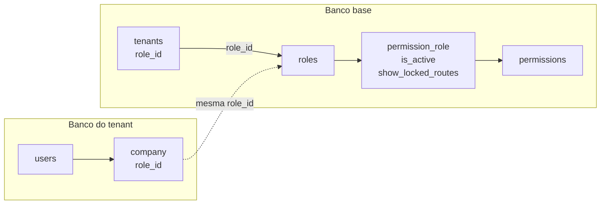

# 🔐 Sistema de Permissões

## Objetivo

O permissionamento é centralizado no **banco base**. Ele define quais recursos cada tenant pode utilizar, independentemente de onde os dados operacionais desse tenant estejam armazenados.

O modelo atual usa uma **role central como pacote de acesso**. Na prática, essa role representa o conjunto de permissões contratado pelo tenant e já prepara o sistema para planos como Básico, Profissional e Enterprise.

> O frontend usa as permissões para compor a experiência da interface, mas o backend é a fonte de verdade e sempre valida o acesso à API.

---

## Princípios

- Permissões e roles não são duplicadas em bancos de tenant.
- Cada tenant aponta para uma role central válida e ativa.
- Todos os usuários de um mesmo tenant usam, atualmente, o pacote de acesso definido para a empresa.
- O banco do tenant guarda apenas uma referência lógica à role para a resolução em tempo de execução.
- Uma permissão desativada nunca concede acesso à API, mesmo que uma rota seja exibida na interface.

---

## Modelo de dados

### Banco base

#### `permissions`

É o catálogo global de capacidades do produto. Cada permissão identifica um módulo ou recurso e contém as informações necessárias para protegê-lo no backend e representá-lo no frontend.

Campos relevantes:

- `id`: identificador da permissão.
- `name`: nome legível, como `Clientes`.
- `slug`: identificador estável da permissão, como `customers`.
- `base_api_url`: base da rota protegida na API, como `api/customers`.
- `base_front_url`: base da rota correspondente no frontend, como `clientes`.
- `group`: agrupamento visual, como `Cadastros` ou `Operacional`.
- `is_base`: informa que a permissão é obrigatória em todas as roles.

Permissões base são sempre sincronizadas como ativas e não podem ser bloqueadas por uma role.

#### `roles`

Representa um perfil de acesso centralizado. No desenho atual, a role deve ser entendida como um **pacote técnico de permissões**, que pode ser associado a um plano comercial.

Campos relevantes:

- `id`, `name`, `slug` e `description`: identificação do pacote.
- `is_active`: determina se a role pode ser atribuída a novos tenants.
- `can_modify`: protege roles internas que não devem ser alteradas ou removidas.

Exemplos de nomes futuros: `Plano Básico`, `Plano Profissional` e `Plano Enterprise`. Não há `role_user`: uma role não é atribuída individualmente aos usuários neste momento.

#### `permission_role`

É a tabela pivot entre `roles` e `permissions`. Ela transforma o catálogo global em um pacote de acesso efetivo.

| Campo | Responsabilidade |
| --- | --- |
| `role_id` | Role central que recebe a configuração. |
| `permission_id` | Permissão global configurada para a role. |
| `is_active` | Libera ou bloqueia o uso da permissão para a role. |
| `show_locked_routes` | Quando a permissão está bloqueada, define se a rota pode aparecer como bloqueada no frontend. |

Uma permissão com `is_active = true` é utilizável. Quando `is_active = false`, `show_locked_routes = true` permite somente sua exibição visual como recurso indisponível; essa combinação nunca libera a API.

---

## Vínculo entre banco base e banco do tenant

Há dois ponteiros para a mesma role central:

| Local | Campo | Finalidade |
| --- | --- | --- |
| Banco base, tabela `tenants` | `role_id` | Mantém o pacote de acesso associado ao cadastro central do tenant. É a referência usada pela administração da plataforma e por uma futura assinatura. |
| Banco do tenant, tabela `company` | `role_id` | Espelha a mesma role para que a aplicação, já conectada ao banco do tenant, resolva as permissões da empresa atual. |

Os dois valores devem permanecer iguais. Como estão em bancos diferentes, `company.role_id` é uma referência lógica: não existe foreign key física atravessando conexões.



### Criação e alteração de tenant

Ao criar ou editar um tenant, o sistema deve:

1. Receber `company.role_id` no formulário administrativo.
2. Validar no banco base que a role existe e está ativa.
3. Gravar o mesmo valor em `tenants.role_id`.
4. Inicializar o banco do tenant e gravar o mesmo valor em `company.role_id`.
5. Ao trocar a role, atualizar os dois registros para manter o espelhamento.

O usuário inicial é criado no banco do tenant, mas não recebe uma role própria. Seu acesso é calculado a partir de `company.role_id`.

---

## Fluxo de autorização

### No backend

1. O domínio identifica e inicializa o tenant.
2. A autenticação JWT identifica o usuário do banco daquele tenant.
3. A aplicação lê `company.role_id` no banco do tenant atual.
4. A role é consultada no banco base junto de `permission_role` e `permissions`.
5. O middleware compara a rota solicitada com `permissions.base_api_url`.
6. A requisição só continua quando houver uma permissão vinculada à role com `is_active = true`.

O middleware `company.permission` é a proteção efetiva das rotas operacionais. O endpoint de permissões retorna o conjunto da role para que o frontend atualize a interface, mas essa resposta não substitui a validação do middleware.

### No frontend

No login e na atualização de permissões, a API retorna as permissões da role atual, incluindo `is_active` e `show_locked_routes`.

- `is_active = true`: o menu e a rota ficam disponíveis.
- `is_active = false` e `show_locked_routes = true`: o item pode ser exibido bloqueado.
- `is_active = false` e `show_locked_routes = false`: o item não deve ser exibido.

Essa distinção permite comunicar funcionalidades de planos superiores sem expor uma rota utilizável.

### Cache

As permissões efetivas são cacheadas por tenant por 30 minutos. O cache é renovado no login e pode ser recarregado pelo endpoint `/auth/permissions`.

Ao alterar a role de um tenant ou a configuração de `permission_role`, a invalidação do cache daquele tenant deve fazer parte do fluxo administrativo para que a mudança seja refletida imediatamente. Sem invalidação, ela será percebida no máximo após o TTL do cache.

---

## Organização por planos

### Estado atual

Embora não exista ainda uma tabela comercial de planos no modelo implementado, a role já funciona como o pacote de permissões do tenant:

```text
tenant → role → permission_role → permissions
```

Assim, para limitar recursos por nível de produto, basta associar o tenant à role correspondente e configurar as permissões no pivot central. Não se deve criar permissões nem roles locais no banco do tenant.

### Exemplo de composição futura

O quadro abaixo é apenas uma referência de produto; as permissões e planos efetivos devem ser definidos antes da implementação comercial.

| Permissão | Básico | Profissional | Enterprise |
| --- | --- | --- | --- |
| Cadastros essenciais (`is_base`) | Ativa | Ativa | Ativa |
| Catálogo | Bloqueada ou visível com cadeado | Ativa | Ativa |
| Vendas | Bloqueada | Ativa | Ativa |
| Estoque avançado | Bloqueada | Bloqueada ou visível com cadeado | Ativa |
| Relatórios avançados | Bloqueada | Bloqueada | Ativa |

Cada coluna pode ser uma role central. Para uma permissão opcional, o registro em `permission_role` define se ela está ativa e se deve aparecer bloqueada.

### Evolução recomendada para assinaturas

Quando a camada comercial for implementada, `plans` e `subscriptions` devem permanecer no banco base e selecionar uma role central, em vez de duplicar permissões:

```text
subscription ativa → plan → role → permission_role → permissions
                                  ↓
                         tenants.role_id
                                  ↓
                         company.role_id
```

Uma modelagem inicial adequada é adicionar `plans.role_id` e fazer a assinatura ativa definir a role do tenant. Em uma troca de plano, o serviço deve validar a nova role, sincronizar `tenants.role_id` e `company.role_id`, e invalidar o cache de permissões.

Se no futuro um plano precisar de variações sem criar muitas roles, uma tabela central de exceções por plano poderá ser avaliada. Até que essa necessidade exista, a relação `role → permission_role` é suficiente e evita duas fontes de verdade.

---

## Regras de manutenção

- Apenas administradores da plataforma gerenciam `roles`, `permissions` e `permission_role`.
- Uma role associada a algum tenant não pode ser removida.
- Roles protegidas por `can_modify = false` não devem ser alteradas.
- Uma role inativa não pode ser atribuída a um tenant.
- Novas permissões devem ser cadastradas no banco base, com suas bases de rota de API e frontend.
- Permissões marcadas como `is_base` devem ser incluídas ativas em todas as roles.
- Alterações de rota exigem atualizar `base_api_url` e `base_front_url` da permissão correspondente.

---

## Limites do modelo atual

- O pacote de acesso é compartilhado por todos os usuários de um tenant.
- Não há tabela `role_user` nem permissões individuais por usuário.
- Planos e assinaturas ainda não determinam a role automaticamente.
- O vínculo entre `company.role_id` e `roles.id` é lógico, não uma foreign key entre bancos.

Caso seja necessário criar níveis de acesso por usuário no futuro, essa evolução deve ser projetada separadamente para combinar o acesso do plano do tenant com o acesso individual, sem permitir que um usuário ultrapasse as permissões contratadas pela empresa.
