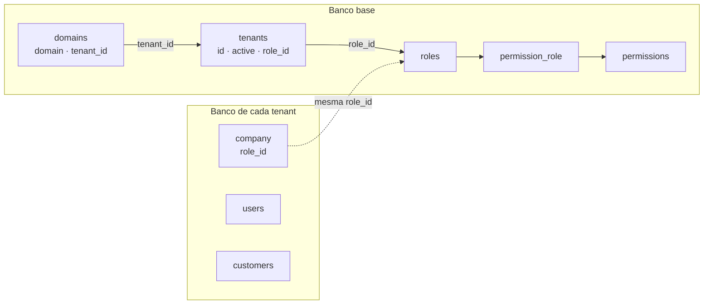

# 🏢 Estratégia de Multi-Tenancy

## Visão geral

O sistema usa multi-tenancy com **um banco de dados por tenant**. O banco base concentra o cadastro dos tenants, seus domínios e as configurações globais de acesso; cada tenant possui um banco isolado para seus dados operacionais.

A identificação ocorre pelo domínio completo da requisição. Depois que o tenant é resolvido, a aplicação inicializa o contexto correspondente e passa a usar sua conexão de banco, cache, filesystem e filas com escopo de tenant.

---

## Estrutura implementada

### Banco base

O banco base contém somente dados globais da plataforma. As migrations atuais criam as tabelas abaixo.

| Tabela | Responsabilidade |
| --- | --- |
| `tenants` | Cadastro central do tenant, com `id`, status `active`, `role_id` e dados resumidos em `data`. |
| `domains` | Mapeia um domínio único ao seu `tenant_id`. É a fonte usada para resolver o tenant da requisição. |
| `roles` | Pacotes centralizados de permissões que podem ser atribuídos a tenants. |
| `permissions` | Catálogo global de recursos e suas bases de rota de API e frontend. |
| `permission_role` | Pivot que define as permissões ativas ou bloqueadas em cada role. |

Não existem no banco base as tabelas `tenant_domains`, `tenant_database_configs` nem uma tabela de usuários globais. O nome correto da tabela de domínios é `domains`, e os usuários da aplicação pertencem ao banco de cada tenant.

### Banco do tenant

Cada banco de tenant possui, no estágio implementado, as seguintes tabelas:

| Tabela | Responsabilidade |
| --- | --- |
| `company` | Dados da empresa do tenant e o espelho de `role_id` usado para resolver suas permissões no contexto do tenant. |
| `users` | Usuários autenticáveis daquele tenant. Não são compartilhados com outros tenants. |
| `customers` | Clientes cadastrados para aquele tenant. |

As estruturas de catálogo, vendas, estoque e ordens de serviço descritas em outros documentos são planejamento de evolução e ainda não possuem migrations no banco do tenant. Esta página descreve apenas a base já implementada.

---

## Relacionamento entre os bancos

O tenant tem uma role central associada em dois pontos:

- `tenants.role_id`, no banco base, representa o pacote de acesso atribuído ao tenant.
- `company.role_id`, no banco daquele tenant, espelha o mesmo valor para que a aplicação o consulte depois de inicializar a conexão do tenant.

O vínculo de `company.role_id` com `roles.id` é lógico, pois os registros estão em bancos distintos e não podem ter uma foreign key física entre si. A criação e a atualização de tenant mantêm os dois campos sincronizados.



O funcionamento de `roles`, `permissions` e `permission_role` está detalhado em [permissions.md](permissions.md).

---

## Resolução da requisição

As rotas de API passam pelo middleware `tenant.domain`, implementado por `InitializeTenantByDomain`.

1. A aplicação recebe a requisição e lê o host completo.
2. `DomainTenantResolver` consulta `domains` para localizar o tenant associado.
3. Se não houver domínio cadastrado, a API responde `404`.
4. Se o tenant estiver inativo, a API responde `403`.
5. `tenancy()->initialize($tenant)` troca o contexto para o tenant resolvido.
6. Os bootstrappers de tenancy aplicam o escopo de banco de dados, cache, filesystem e filas.
7. A rota continua usando o banco daquele tenant.

Exemplo conceitual:

```text
empresa-a.api.exemplo.com → domains → tenant empresa-a → banco tenant_empresa-a
empresa-b.api.exemplo.com → domains → tenant empresa-b → banco tenant_empresa-b
```

O domínio de API é montado a partir do identificador do tenant e do host configurado em `APP_URL`. O domínio de frontend é derivado sem o prefixo `api` quando necessário.

---

## Criação de tenant

O fluxo implementado pelo `TenantService` é:

1. Recebe os dados da empresa, do usuário inicial e a `company.role_id` escolhida.
2. Valida que a role existe e está ativa no banco base.
3. Cria o registro em `tenants` com `id`, `active`, `role_id` e o nome resumido em `data`.
4. Cria o registro correspondente em `domains`.
5. O evento de criação do tenant provisiona o banco e executa as migrations de `database/migrations/tenant`.
6. O serviço inicializa o novo tenant e grava `company`, incluindo o mesmo `role_id` central.
7. O serviço cria o primeiro registro em `users` no banco do tenant.
8. Ao terminar, o contexto de tenancy é encerrado e a aplicação volta ao banco base.

O job automático de seed de tenant está desabilitado. Portanto, o provisionamento padrão não executa `DatabaseTenantSeeder`; os dados iniciais de `company` e do usuário são criados diretamente pelo serviço. Seeders podem ser executados explicitamente quando necessários.

### Atualização de tenant

Ao editar um tenant, o serviço atualiza os dados de `company` dentro do banco do tenant e, no banco base, sincroniza:

- `tenants.role_id`;
- `tenants.data.name`;
- `company.role_id`.

Essa sincronização é necessária para que o cadastro administrativo e a autorização em tempo de requisição apontem para o mesmo pacote de acesso.

---

## Isolamento e responsabilidades

### Dados centralizados

- Identidade e status do tenant.
- Domínios usados para resolução.
- Roles, permissões e suas configurações.

### Dados isolados por tenant

- Empresa.
- Usuários autenticáveis.
- Clientes e demais dados operacionais que forem adicionados ao banco do tenant.

Nenhuma consulta operacional deve usar outra conexão de tenant. Consultas ao banco base só devem ocorrer para recursos globais, como a resolução de permissão a partir de uma role central.

---

## Planos e assinaturas — evolução futura

`plans` e `subscriptions` ainda não possuem migrations nem participam do fluxo atual de provisionamento ou autorização. Quando forem implementados, devem permanecer no banco base.

A evolução recomendada é:

```text
subscription ativa → plan → role → permission_role → permissions
                                 ↓
                        tenants.role_id
                                 ↓
                        company.role_id
```

Nesse modelo, o plano comercial seleciona uma role central, e a role continua definindo o conjunto técnico de permissões. Uma troca de plano deve validar a nova role, sincronizar `tenants.role_id` e `company.role_id`, e invalidar o cache de permissões do tenant.

Essa separação evita duplicar permissões por plano ou por tenant e mantém uma única fonte de verdade para autorização. Mais detalhes sobre a composição de planos por role estão em [permissions.md](permissions.md#organização-por-planos).
